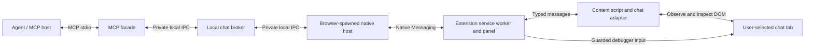

# Browser Chat MCP: Design and Implementation Plan

Status: proposed, for discussion before implementation.

Research date: 2026-09-25. No application has been implemented or live chat integration tested as part of this document.

## 1. Recommendation

Build a **browser-chat integration**, not a general browser automation MCP server:

- A browser extension lets the user explicitly connect the tab and conversation they already have open.
- A local broker manages authorization, conversation bindings, message observations, and outgoing operations.
- An MCP interface exposes a small set of chat operations with structured results.
- A generic, user-configurable DOM adapter covers conventional chat layouts; reviewed site adapters handle applications such as Gemini and WhatsApp Web.
- Use TypeScript throughout. Use the official MCP SDK, WXT for extension development, and Playwright for feasibility experiments and end-to-end testing.
- For reliable rich-text input, use a narrowly implemented browser-debugger input driver inside the extension. Do not expose raw debugger commands or arbitrary JavaScript to the agent.

**The important qualification:** generic discovery is achievable; universally reliable sending and complete history extraction from every chat website are not. The product should publish capabilities and refuse unsupported operations rather than guess.

For the first supported AI-chat integration, use Gemini's browser interface. It is a representative target, not an architectural dependency. No model-provider API integration is necessary.

## 2. Scope and Product Contract

### Initial scope

- Desktop Chrome and Edge, one local user, an ordinary HTTP(S) browser tab.
- Existing login sessions remain in the user's browser; login and MFA remain manual.
- One explicitly selected conversation per connection, initially one active writer.
- Read currently rendered messages and retain subsequently observed messages in a bounded, temporary buffer.
- Send plain text, including multiline text and Unicode, through the website's composer.
- Observe incoming messages and revisions to streaming AI responses.
- Give the user a persistent connection indicator, outgoing-message approval, pause, and disconnect controls.

The software may use command-line launchers for installation and MCP startup, but the **chat target is always a browser UI**, not a terminal chat application.

### Not part of the first release

- Native desktop applications, mobile browsers, or arbitrary operating-system window control.
- Automatic login, CAPTCHA handling, account creation, or evasion of platform controls.
- Bulk outreach, contact harvesting, unattended cross-conversation navigation, or built-in bot-to-bot orchestration.
- Attachments, voice messages, reactions, edits, deletes, and automatic link opening.
- Complete server-side history, guaranteed recipient delivery, or guaranteed real-time operation while the browser is suspended.
- A hosted service, distributed database, plugin marketplace, or an LLM embedded in the MCP server.

## 3. Browser Access: Options and Decision

| Approach | Existing logged-in tab | Main benefit | Main drawback | Decision |
| --- | --- | --- | --- | --- |
| Custom WebExtension and local bridge | Yes, after user authorization | Purpose-built selection, observations, approvals, and revocation | Extension and native-host installation; rich editors need additional input support | Recommended product architecture |
| Existing Playwright extension and Playwright MCP | Yes | Already provides a consent and tab-selection workflow | Broad browser permissions and general automation surface; no chat semantics | Use as the feasibility baseline |
| Playwright attached through a remote-debugging endpoint | Only if debugging access was enabled | Mature automation API | Not a universal attach-to-any-running-browser mechanism | Optional developer backend later |
| Playwright-managed persistent browser profile | Requires a separate browser session and login | Predictable, testable environment | Does not deliver the desired existing-tab experience | Useful alternative if extensions are unacceptable |
| Screenshot/OCR and OS mouse control | Visually, yes | Can reach non-DOM interfaces | Focus, layout, scaling, attribution, and duplicate-detection problems | Not a default; no blind visual sending |
| Official messaging/provider APIs | Independent of the browser UI | Usually the strongest delivery contract | Different permissions and scope; does not operate the selected UI conversation | Separate integration, not a replacement for this request |

### Why not simply use Playwright for everything?

Playwright is well suited to controlled browser automation. Its Chrome extension already lets a user choose an existing tab and reuse login state. This is useful prior art and a fast way to demonstrate the basic idea. [1]

However, attaching to a tab does not answer the domain questions: which elements are actual messages, which conversation is authorized, whether a streaming reply is finished, and whether retrying a send will duplicate it. A chat-specific layer remains necessary with any browser-control library.

The proposed custom extension is justified by its chat picker, browser-owned approval UI, continuous DOM observation, and enforcement close to the selected tab. Do not fork Playwright or rely on undocumented extension-transport internals. Start the feasibility work with its documented extension mode; it remains a viable smaller solution if general browser access and best-effort chat handling turn out to be sufficient.

Ordinary CDP attachment is not an alternative to obtaining permission. Playwright documents Chromium-only support and lower fidelity for `connectOverCDP`. Chrome 136 also stopped honoring remote-debugging switches against the default user-data directory. Do not design around silently attaching to an arbitrary daily-use profile or copying its cookies. [2][3]

## 4. User Experience

### First-time setup

1. Install the browser extension and local companion package.
2. Register the companion's native-messaging host for that browser and OS user.
3. Add the MCP server to the agent host. The launcher starts or connects to the local broker.
4. Open and log in to the desired chat website normally.

Installation should ultimately be handled by one companion installer per supported OS. An extension alone cannot install its native host. In the current development setup, both the browser and native host will run inside the same Podman devcontainer. A containerized companion cannot register a host for a separate browser running on Windows or WSL.

### Connect a conversation

1. The agent requests a connection. The broker creates a short-lived pending request without reading any tab.
2. The user brings the desired tab to the foreground and clicks the extension's **Connect This Chat** action.
3. The extension shows the pending client request and detects the active conversation.
4. For a known application, it previews the detected conversation, recent message boundaries, and composer. For an unknown application, the user calibrates these elements.
5. The user approves that connection in the extension's own UI and chooses read-only or send-with-approval mode.
6. The agent receives an opaque connection handle and capability report, not unrestricted browser access.

This is the practical equivalent of the proposed window click: **activate the tab, then invoke the extension**. Merely clicking an operating-system window does not grant DOM access. A screen-sharing picker supplies pixels, not message structure or control rights.

The browser's `activeTab` grant requires a supported user gesture. It can survive same-origin navigation, but it is revoked on cross-origin navigation or tab closure. Application authorization must be narrower than this: selecting another conversation on the same origin must not silently authorize that conversation. [4]

### While connected

- Show the origin, conversation identity, connected client, read/write mode, and connection health in an extension panel.
- Review exact outgoing text and the intended conversation in that panel; approvals never come from page content.
- An injected highlight can help select elements, but it is not an authorization surface because the page can imitate or manipulate it.
- Preserve existing user drafts. Pause writes when unexpected user interaction or a changed conversation is detected.
- Disconnect revokes queued actions, stops observation, releases debugger attachment, and makes buffered content inaccessible through that connection. It does not close the user's tab or log them out.

## 5. Architecture

### Component responsibilities

| Component | Responsibilities |
| --- | --- |
| MCP facade | Tool schemas, result formatting, client compatibility, cancellation, and optional resource notifications |
| Broker | Connection ownership, grants, operation journal, event cursors, deadlines, rate limits, and write serialization |
| Native host | Small transport relay between the browser and broker; no chat parsing or general command execution |
| Extension service worker | Validate browser message senders, enforce selected targets, route observations, execute approved input operations, and handle browser lifecycle events |
| Extension panel | Connection approval, calibration, pending-message review, pause, and revoke controls |
| Content script and adapters | Resolve message/composer elements, identify conversations, normalize messages, and observe UI changes |

Use one installed Node package with separate launcher modes for the facade, broker, and native host. These are small processes with different lifecycles, not separate services requiring a distributed deployment.

### Why a native bridge?

Native Messaging avoids exposing an unauthenticated browser-control HTTP or WebSocket listener. The host manifest names the exact allowed extension ID. The extension uses `runtime.connectNative` for bidirectional communication. [5]

The native host is **spawned by the browser**, while an MCP stdio server is normally spawned by the MCP client. They cannot both own the same process's standard streams. Native Messaging also uses length-prefixed JSON, whereas MCP stdio uses newline-delimited JSON. A relay and private local IPC explicitly resolve this difference.

On Linux/macOS, use a Unix-domain socket in a user-private runtime directory. On Windows, use a named pipe restricted to that user. Authenticate facade registrations, restrict the native relay role, and use an atomic singleton startup mechanism for the broker. Do not trust a client-supplied display name as authentication.

Version the internal message protocol. Include request IDs, connection generation, deadlines, and validated payload types. Bound and chunk observation batches below the native host's 1 MiB outbound message limit; a 256 KiB application envelope limit is a reasonable starting point. [5]

## 6. Browser Permissions and Input

The control-capable extension requires `activeTab`, `scripting`, `storage`, `nativeMessaging`, and `debugger`, plus `sidePanel` if the Chrome side-panel API is used. Avoid blanket host permissions and browser-history/cookie permissions. Inject scripts only after the user selects a tab.

**Important permission tradeoff:** Chrome does not allow `debugger` in `optional_permissions`. It must be declared as a required permission for the control-capable extension. A runtime checkbox cannot turn a low-permission extension into a debugger-enabled one. [6]

The debugger permission is powerful and is not technically restricted by `activeTab`. Selected-tab restrictions must therefore be enforced by trusted extension code. Read-only mode reduces what this application permits, not the installed extension's underlying maximum privilege. A separately packaged no-debugger edition is possible later, but is not necessary for the MVP.

### Sending through modern editors

Do not assume assigning `textarea.value`, setting `innerHTML`, or dispatching a synthetic keyboard event reproduces user editing. Framework-controlled inputs and rich-text editors can reject these changes or keep different internal state. Script-dispatched events are not trusted browser input. [7]

Use a small, typed input driver over `chrome.debugger`, limited to the selected tab and operations needed by the adapter: focus the verified composer, insert text, activate the verified send control, and inspect the resulting UI state. Prefer the actual send button; use Enter only when the adapter knows the site's configured submit behavior. Never paste through the user's clipboard.

The agent cannot choose CDP methods, coordinates, selectors, or executable expressions. The extension resolves and checks targets itself. Do not expose network interception, cookie extraction, arbitrary navigation, or an unrestricted evaluate tool.

Debugger access improves input reliability; it does not guarantee acceptance by every website or bypass browser/platform restrictions. Handle attachment rejection, user cancellation, and DevTools-triggered detachment explicitly. [8]

## 7. Connections and Authorization

A connection is an application-level binding, not an MCP transport session.

Internally bind:

- Authenticated local client identity and a broker-minted connection ID.
- Browser-profile installation identity and current browser instance.
- Tab ID, frame/document identity, and a monotonically changing connection generation.
- Exact origin and adapter-provided conversation/account identity when observable.
- Granted operations, expiry, approval policy, and any rate/message limits.

Every read and action checks ownership and the current grant. Every write also checks generation, document, conversation, composer, and approval. An opaque handle is not a substitute for authorization.

Use stable conversation identifiers from the visible URL or supported DOM metadata when available. A display title alone is insufficient: different conversations can have identical names, and an AI chat can rename itself. For supported new-chat flows, an adapter may recognize the expected transition from an unsaved chat to its newly assigned conversation ID after submission. Unknown identity transitions require reconnection.

Suggested connection states are `pending`, `calibrating`, `ready_readonly`, `ready_write`, `paused`, `stale`, and `disconnected`. A stale or paused connection never executes queued writes automatically on recovery.

Reloads require a fresh document check; browser or broker restarts invalidate active write grants. Cross-origin navigation, account changes, unexpected conversation changes, or revocation invalidate pending approvals. A tab ID reused later cannot revive an old connection.

## 8. Generic Adapter Strategy

Use progressive support, not a universal selector or a model making a fresh guess for every message.

| Level | How it works | Supported behavior |
| --- | --- | --- |
| Reviewed site adapter | Versioned adapter for a known UI, initially Gemini | Highest confidence in conversation identity, messages, editor input, and streaming/submission indicators |
| Calibrated generic adapter | User identifies relevant elements; saved declarative profile | Basic reading and sending only where identity and writer checks pass |
| Automatic discovery | Rank semantic DOM candidates and offer a preview | Setup assistance; no automatic write authorization |
| Unsupported | Missing structure, ambiguous identity, or unsupported editor | Explain the limitation and remain read-only or disconnected |

### Generic calibration

The picker identifies the conversation header/identity region, message-list container, a representative message row, composer, and send control. Optional mappings identify sender, direction, timestamps, and generation status. Preview multiple rows, including both directions when possible, before accepting a profile.

Prefer semantic roles, accessible names, labels, stable attributes, and scoped relative selectors. Avoid absolute XPath and deep positional selectors as primary identifiers. Use `dom-accessibility-api` for accessible-name/role semantics rather than inventing an accessibility parser. Reading DOM/ARIA attributes is not equivalent to having the browser's entire accessibility tree.

Save profiles as bounded declarative configuration: origin, structural signature, selectors, supported editor strategy, and validation rules. Profiles must not contain executable JavaScript. An agent may suggest a repair, but a human must approve a changed target mapping before writes resume.

### Adapter responsibilities

Each adapter implements the same conceptual operations: detect compatibility, identify the conversation, locate the timeline, parse a message row, read the composer, describe input actions, inspect submission evidence, and identify generation state. The broker owns policy, deduplication, cursors, and deadlines; adapters must not reimplement them.

Use bundled, reviewed TypeScript adapters for exceptional application behavior. Sharing the same rich-text editor does not imply two sites share message identity or conversation semantics.

Initially support top-level DOM chat UIs. Open shadow roots can be handled explicitly; cross-origin frames need additional scoped permission and frame tracking. Canvas-only UIs, inaccessible structures, and closed shadow roots without a tested access path are not promised support.

## 9. Reading and Observing Messages

### Observation pipeline

1. Establish conversation identity and install a `MutationObserver` before taking the initial snapshot.
2. Snapshot only the configured timeline, then reconcile buffered mutations so snapshot-to-stream handoff does not lose updates.
3. Parse changed rows into normalized messages and coalesce rapid revisions.
4. Validate source document/generation and append bounded events to the broker's buffer.
5. Return snapshots or incremental events to authorized callers.

Do not repeatedly extract the whole page. Scope observation to the message area, with separate lightweight guards for conversation identity and composer state. Use occasional reconciliation when needed, especially after reconnects or large rerenders; MutationObserver callbacks alone are not proof of completeness.

### Message model

| Field | Meaning |
| --- | --- |
| `messageId` | Local stable identifier within the connection's observation history |
| `nativeId` | Site identifier, when actually available; otherwise null |
| `identityQuality` | Whether identity is native, locally tracked, or uncertain |
| `sender` | Observed sender metadata, with unknown fields left null |
| `direction` | `incoming`, `outgoing`, or `unknown` |
| `text` | Message text preserving meaningful newlines and code formatting |
| `sourceTimestamp` / `timestampRaw` | Parsed timestamp only when justified, plus original UI representation |
| `observedAt` | When this system observed the message, not when the sender sent it |
| `revision` | Increases when the observed message changes |
| `generationState` | `streaming`, `complete`, `settled_heuristic`, or `unknown` |

Do not deduplicate solely by text hash: two legitimate messages can both say "OK". Prefer native IDs; otherwise track local identity conservatively and report ambiguity. Virtualized interfaces recycle DOM nodes, so node identity alone is also insufficient. A content hash is useful for detecting revisions, not proving identity.

Newly discovered DOM rows are observations, not necessarily newly received messages. Distinguish initial snapshots, live observations, and any later history backfill. A row disappearing from a virtualized list is not a deletion; emit a deletion only when the UI supplies corresponding evidence.

For AI responses, publish revisions under one message identity where possible. Use adapter-specific indicators to declare completion. A quiet period, for example 750 ms without edits, can mean `settled_heuristic`, never confirmed completion. A stalled network can look quiet too.

### Coverage, cursors, and retention

Every snapshot includes coverage such as `rendered_only` or `observed_since_connect`, a freshness timestamp, a generation, and an event cursor anchored to that snapshot. Reading is non-destructive: each consumer maintains its own cursor.

An event cursor encodes an observation-stream epoch and sequence, not a website timestamp or message ID. Buffer eviction, a process restart, or an unrecoverable observation gap produces an explicit `CURSOR_EXPIRED` or gap result and a resynchronization path. Never silently jump to the current end.

Keep transcript data in bounded memory by default. Proposed starting limits are 1,000 events or 5 MiB per connection, whichever comes first; make limits configurable and coalesce streaming revisions. Persist adapter profiles and send-operation metadata separately. Do not present the buffer as a complete transcript archive.

Do not automatically scroll for history in the MVP. Later backfill must be separately authorized, bounded by time/message count, restore the viewport when practical, and identify gaps. The website itself may change presence or read receipts while a conversation is open; the integration cannot promise to suppress those effects.

## 10. Sending Without Blind Retries

Sending has external effects. A successful DOM click is not sufficient evidence that the message was accepted, delivered, or read.

### Prepare, authorize, commit, reconcile

1. **Prepare:** validate the connection, text limits, idempotency key, and target identity. Create an operation bound to the exact text and connection generation. Do not modify the website yet.
2. **Authorize:** display the exact message and target in trusted extension UI. Human approval is bound to the operation, expires quickly, and cannot be supplied as an agent-controlled `approved: true` argument.
3. **Preflight:** acquire the connection's writer lock; recheck the current document/conversation and ensure the composer has no unrelated draft. Confirm the send control is available and unobstructed.
4. **Fill:** enter text using the verified editor strategy. Read it back and compare against the approved content, allowing only explicitly documented editor normalization. Abort on unexpected user edits or identity changes.
5. **Commit:** durably record that dispatch is starting, recheck the target and approval, then activate the send control once. The browser side rejects duplicate operation dispatches within its current generation.
6. **Reconcile:** inspect newly observed outgoing-message evidence and application status. Correlate native message ID, direction, content, and observation ordering when available. Composer clearing alone is not confirmation.

Default policy is approval for each send. A later explicitly granted autonomous mode can be limited to one conversation, a short lifetime, and a small message/rate budget. The agent must not be able to widen that grant itself.

### Result states

| State | What the caller may infer |
| --- | --- |
| `prepared` / `awaiting_approval` | No submission has occurred |
| `approved` | Permission exists for this exact operation, subject to fresh preflight checks |
| `dispatching` | Submission may be in progress; do not create a replacement operation |
| `observed_in_ui` | Matching outgoing evidence appeared; this may still be a local optimistic echo |
| `accepted_by_service` | The adapter observed a documented UI indicator of service acceptance |
| `failed_before_dispatch` | This operation did not activate submission |
| `unknown` | A submission might have occurred, but its outcome cannot be established |

Recipient delivery/read status is a separate optional observation, never inferred from `observed_in_ui`. Likewise, an AI reply beginning is useful evidence but does not identify a formal provider-side delivery receipt.

### Idempotency and crash behavior

Store operation IDs, client-scoped idempotency keys, target identity, a keyed content digest, phase, and available receipt metadata in SQLite. Persist the transition to `dispatching` before issuing input. Avoid storing message bodies in the durable journal by default.

The same key and arguments return the existing operation; reuse with different arguments is an error. A retry of `commit` returns or reconciles the existing operation and does not click again. Restart recovery treats an interrupted dispatch as `unknown`, and new write grants require user approval. Journal retention and the deduplication window must be explicit; expired operation handles are rejected, not replayed.

**Exactly-once delivery cannot be guaranteed through an arbitrary UI.** A crash can occur after the website accepted the message but before the broker saw evidence. Prefer an uncertain result requiring review over an automatic duplicate. If the website itself retries or duplicates a request, the MCP layer cannot provide stronger server-side guarantees than the website exposes.

Serializing agents does not lock out the human or the website. Fresh guards, draft checks, and cancellation reduce races, but cannot make multiple UI actions an atomic transaction. This is another reason to keep uncertain targets read-only and require supervised sending initially.

## 11. MCP Interface

Keep the public tool list small and stable. Per-connection capabilities are returned as data rather than dynamically exposing arbitrary browser tools.

| Tool | Main arguments | Result and behavior |
| --- | --- | --- |
| `chat.request_connection` | Optional user-facing label | Short-lived connection request; waits for browser-side user selection without scraping tabs |
| `chat.get_connection` | Connection request ID | Pending/ready state, connection handle, generation, target summary, capabilities, and health |
| `chat.read_messages` | Connection handle, bounded limit, optional snapshot-pagination token | Structured snapshot, coverage, freshness, and event cursor; no automatic scrolling |
| `chat.wait_for_events` | Connection handle, event cursor, bounded timeout and limit | Incremental observations/revisions/status changes; returns normally on timeout |
| `chat.prepare_message` | Connection handle, expected generation, text, idempotency key | Operation ID, canonical preview, and approval state |
| `chat.commit_message` | Operation ID | Executes only if approved and still valid; otherwise reports the blocking state |
| `chat.get_operation` | Operation ID | Current status and evidence; the recovery path for ambiguous outcomes |
| `chat.disconnect` | Connection handle | Revokes access and cancels pending work |

Use shared Zod schemas, bounded inputs, output schemas, and structured tool results. Include a serialized text representation where needed for older clients. Mark reads appropriately; mark sending as a non-read-only external action. Tool annotations help clients present risk but are not access controls.

Domain failures should be actionable, for example `CONVERSATION_CHANGED`, `DRAFT_PRESENT`, `APPROVAL_REQUIRED`, `ADAPTER_STALE`, `BROWSER_DISCONNECTED`, `CURSOR_EXPIRED`, and `SEND_OUTCOME_UNKNOWN`. Return structured error details with whether a safe retry is possible. A transport failure after dispatch does not become a known send failure.

### Receiving does not automatically wake an agent

The universally useful baseline is `read_messages` plus a bounded `wait_for_events` call, for example 20 seconds with a server-configured cap below the host's tool timeout. Waiting must not hold the writer lock or prevent disconnect/cancellation.

An optional resource template such as `chat://connections/{id}/messages` can support change subscriptions. However, a notification to an MCP client is not a guarantee that its host will start a new model turn or send a reply. An always-on responder needs a separate host/orchestration loop and explicit user authorization. The MCP server is a connector, not that scheduler.

### Current protocol compatibility

As of this research date, the official TypeScript SDK's stable v2 line implements MCP `2026-07-28`. That revision removed protocol-level initialization sessions and changed resource subscriptions to `subscriptions/listen`; older examples using only `resources/subscribe`, a permanent HTTP GET stream, or `Mcp-Session-Id` are not the current protocol shape. [9][10]

Use the official SDK and its documented compatibility facilities for the target hosts, rather than hand-writing either protocol generation. Verify actual VS Code and one other host during the feasibility phase. Keep connection IDs and operation IDs explicit application handles across both generations.

Start with stdio. If resources are added, serve private, immediately stale chat snapshots rather than shared-cacheable transcripts. Treat subscription notifications as hints to read after the last application cursor. Do not depend on transport-level replay for recovery. [10][11]

## 12. Lifecycle and Deployment

### Browser and extension lifecycle

Manifest V3 service workers can terminate and restart. A native-messaging connection keeps the worker alive while connected, but the design must still survive crashes, browser updates, sleep, tab discard, and native-host loss. Keep only recoverable routing state in extension session storage and authoritative operation state in the broker. [12]

On reconnection, establish a fresh document/generation, resnapshot, and report any observation gap. Do not auto-replay pending sends. Background rendering and website updates can be throttled or stopped, so health reports must distinguish connected, observing, stale, and suspended states.

### Local, container, and remote hosts

The extension and native companion run where the browser runs. For this project's Podman devcontainer workflow, that means **Chromium, its installed extension, the native messaging host, the broker, and the MCP facade all run inside the same container**. Node/npm and Chromium are installed in the image; WSLg's X11 socket only carries the browser window to Windows. The container browser has its own persistent profile: users log in there manually; the extension cannot attach to existing tabs in Windows or WSL Chromium.

For an eventual non-container desktop deployment, run the native companion alongside the user's chosen desktop browser. Container-based development does not change that product requirement. A broker inside a container cannot access a separate host browser just because both have an address called `localhost`.

Use stdio and private local IPC among processes in the container, with no TCP browser-control listener. The synthetic fixture runs on container port 8787; VS Code may forward it for optional Windows preview, but the devcontainer does not publish a fixed host port. If a future deployment separates the MCP host and browser companion across machines or containers, add an **opt-in authenticated Streamable HTTP facade** through a deliberately configured private tunnel. This is a separate deployment profile, not a reason to expose the browser's debugger port.

The HTTP endpoint must validate Origin and Host, authenticate and authorize every caller, and bind to loopback by default. Use TLS for non-loopback access and the SDK's documented authorization facilities for remote deployments. A tunnel does not replace application authorization; never enable wildcard browser origins or assume CORS alone protects a local control endpoint. [11]

With the agent and browser both inside this devcontainer, remote broker access is unnecessary for the MVP. Defer its packaging and authentication UX unless the target deployment later requires separate locations.

## 13. Security and Privacy

| Risk | Required control |
| --- | --- |
| Agent accesses unrelated conversations | User-selected bindings, authenticated ownership, exact target checks, no arbitrary tab or recipient selection tools |
| Malicious page impersonates approval | Approval only from extension-owned UI; browser-provided sender identity validation; no page-to-native command forwarding |
| Incoming message contains prompt injection | Treat all chat content as untrusted external data, never as system instructions or executable configuration |
| Injection persuades agent to exfiltrate information | Per-message review by default, narrow recipient grants, message limits, and host-side instruction boundaries; sanitization alone is insufficient |
| Misrouted or duplicated send | Fresh conversation/document guards, preserved drafts, one writer, durable operation journal, and explicit unknown outcomes |
| Broad debugger capability is abused | Small reviewed command surface, selected-target enforcement, no raw browser tools, and visible browser/user revocation |
| Local web page probes the companion | Native Messaging and private IPC by default; authenticated, origin-validated HTTP only when explicitly enabled |
| Sensitive conversations persist unexpectedly | Bounded memory buffers, no transcript/screenshot logging by default, restrictive local file permissions, and explicit retention controls |

Render previews as text, not executable HTML. Do not read browser cookies, passwords, unrelated page regions, local storage, or network payloads for convenience. Do not log authorization material. Built-in adapters are reviewed code; configuration profiles cannot download and execute code.

Local operation does not mean chat content stays local after it is returned to an agent: the MCP host may forward it to a cloud model or retain tool logs. Make that boundary explicit during connection approval. The website's encryption protects its own transport, not exported plaintext in an agent context.

The trust boundary excludes a compromised browser, installed companion, extension, or malicious process running with equivalent OS-user access. These controls constrain agent and page behavior; they do not turn a powerful browser extension into a sandbox against its own code.

Respect each site's terms and account rules. Browser automation is not made compliant merely by using the official website. WhatsApp, for example, publishes restrictions on adversarial automation and messaging behavior. Do not promise universal platform approval or evade anti-abuse measures. [13]

## 14. Libraries and Code Organization

| Area | Selection | Reason |
| --- | --- | --- |
| Runtime/language | Node.js 24 LTS and TypeScript | Shared browser/server types and a mature local tooling ecosystem |
| MCP | Official `@modelcontextprotocol/server` v2; documented legacy compatibility when needed | Current protocol support without a homegrown implementation |
| HTTP, if enabled | Official `@modelcontextprotocol/node` integration | Reuse transport/SDK validation instead of designing another protocol |
| Extension build | WXT, Manifest V3, small TypeScript UI | Extension-specific development and packaging; no large UI framework required |
| Validation | Zod v4 | Shared runtime validation for MCP, IPC, adapter profiles, and observations |
| DOM semantics | Native DOM APIs and `dom-accessibility-api` | Incremental observation and standard accessible-name handling |
| Browser input | `chrome.debugger`, with `devtools-protocol` types | Trusted browser input without exposing a general automation API |
| Operation journal | SQLite through `better-sqlite3` | Local transactional state; no database service |
| Tests | Vitest and `@playwright/test` | Deterministic domain tests and real extension/browser workflows |

Pin tested versions when implementation begins. Check native SQLite packaging on each supported OS. WXT does not replace understanding browser permissions or lifecycle rules. [14]

Keep three main code units initially: shared contracts/domain logic, the local companion/MCP package, and the extension with its bundled adapters. Keep tests adjacent to the behavior they cover and share a deterministic fixture-chat application. Do not create a generalized remote plugin platform or multiple browser backends before the first adapter works.

## 15. Implementation Plan and Gates

The following work starts only after approval of the design.

| Phase | Deliverables | Exit criteria | Rough effort |
| --- | --- | --- | --- |
| 0. Feasibility | Existing Playwright-extension experiment; minimal chat fixtures; targeted rich-editor and permission probes; MCP host compatibility check | Select an existing tab; read bounded messages; demonstrate an authorized send on a disposable Gemini conversation; identify native-driver requirements and any policy blockers | 2-3 engineering days |
| 1. Read-only vertical slice | Local broker, native relay, extension connect/revoke UI, basic adapter, MCP request/read/wait/disconnect tools | No access before approval; only selected conversation returned; snapshot/event handoff and revocation work; no writes implemented | 4-6 days |
| 2. Safe sending | Debugger input driver, explicit install-time permission disclosure, prepare/approve/commit flow, durable journal, draft/conflict checks | Rich-editor round trip works; crash/retry tests do not cause a second dispatch; uncertain outcomes are surfaced correctly | 5-8 days |
| 3. Generic support | Calibration picker, declarative profiles, Gemini-specific streaming/identity behavior, second distinct chat integration | Known site works without calibration; an unfamiliar fixture works through calibration; broken profiles stop writes; no core changes are needed for the second adapter | 4-7 days |
| 4. Packaging and hardening | Installer/uninstaller, reconnect UX, client documentation, privacy controls, targeted cross-browser/manual tests | Clean installation and removal; supported browser/host matrix passes; secrets and transcripts absent from default logs | 4-7 days |
| Later | Extra site adapters, history backfill, richer messages, additional browsers, remote profile, tightly scoped autonomous grants | Each feature gets an explicit capability, permission policy, and acceptance tests | Scope separately |

For one engineer, a supervised useful alpha is approximately 2-3 weeks; a hardened local Chromium release is roughly 4-7 weeks. These are planning ranges, not commitments. Browser-store review, enterprise policy constraints, adapter breakage, remote deployment, and multi-OS installers can add substantial time.

The earliest go/no-go is Phase 0. If the full-control extension's required permission or native installation is unacceptable, choose a separate Playwright-managed profile or a more limited read-only product; do not hide the tradeoff behind an unreliable synthetic-input fallback.

## 16. Verification Strategy

### Deterministic tests

- Parse message text, multiline code, Unicode, timestamps, unknown senders, quoted messages, and repeated identical messages.
- Exercise streaming revisions, delayed continuation after a quiet interval, optimistic outgoing rows, and virtualized node recycling.
- Verify snapshot-to-event cursor consistency, bounded-buffer overflow, cursor expiration, and reconnection gaps.
- Test connection expiry, exact-origin checks, generation mismatches, account/conversation changes, stale approvals, and competing clients.
- Inject failures before filling, before dispatch, immediately after dispatch, and after UI evidence but before the tool response.
- Retry identical operations after each failure; assert no second dispatch from the connector and no false delivery claims.
- Verify that malformed IPC, page-origin approval attempts, oversized payloads, and agent-controlled arbitrary browser commands are rejected.

Use Playwright's bundled Chromium with a persistent context for automated extension tests. Its documentation notes that branded Chrome/Edge removed the command-line flags used for extension side-loading, so separately validate the installed-extension path in real supported browsers. [15]

### Real-site acceptance

Use disposable conversations and authorized test accounts. Start with Gemini, then a distinct messaging-style web UI; WhatsApp Web is a candidate subject to platform constraints and explicit test consent. Do not automate ordinary personal conversations in CI.

Acceptance requires correct message boundaries, successful plain-text submission with honest evidence, handling of route/title changes, safe pause on ambiguous identity, and visible revoke behavior. A site is supported only for the browsers, UI variants, locales, and operations actually validated. Automated fixture success alone does not certify a live site.

### Performance targets

Initially target observation-to-event latency under 500 ms at the 95th percentile for active fixture tabs, excluding network/model generation time. Target cached reads under 200 ms, bounded memory, and no full-page rescans per keystroke. Measure these during implementation; they are not current results. No latency target applies while the browser or website is suspended.

## 17. Decisions to Confirm Before Building

Recommended defaults are Chromium-first, Gemini as the first real AI-chat adapter, native companion installation, supervised sends, no permanent transcript storage, and local stdio transport.

Only a few product choices need confirmation: whether the install-time debugger permission is acceptable, whether the initial MCP host runs locally or in a remote/container environment, which second chat UI to validate, and whether the first delivery needs installers beyond Linux. None requires tying the architecture to a particular model provider.

The system's value should be **controlled, inspectable chat operations with explicit limitations**, rather than a claim that every website can be automated identically.

## Sources

Primary documentation reviewed for this proposal; facts about a live site's compatibility still require the planned experiments.

[1]: https://github.com/microsoft/playwright/tree/main/packages/extension
[2]: https://playwright.dev/docs/api/class-browsertype#browser-type-connect-over-cdp
[3]: https://developer.chrome.com/blog/remote-debugging-port
[4]: https://developer.chrome.com/docs/extensions/develop/concepts/activeTab
[5]: https://developer.chrome.com/docs/extensions/develop/concepts/native-messaging
[6]: https://developer.chrome.com/docs/extensions/reference/api/permissions
[7]: https://developer.mozilla.org/en-US/docs/Web/API/Event/isTrusted
[8]: https://developer.chrome.com/docs/extensions/reference/api/debugger
[9]: https://github.com/modelcontextprotocol/typescript-sdk
[10]: https://modelcontextprotocol.io/specification/2026-07-28/changelog
[11]: https://modelcontextprotocol.io/specification/2026-07-28/basic/transports/streamable-http
[12]: https://developer.chrome.com/docs/extensions/develop/concepts/service-workers/lifecycle
[13]: https://www.whatsapp.com/legal/messaging-guidelines
[14]: https://wxt.dev/guide/introduction.html
[15]: https://playwright.dev/docs/chrome-extensions

- [Playwright existing-browser extension][1]
- [Playwright CDP attachment][2] and [Chrome debugging-profile restrictions][3]
- [User-activated tab access][4], [Native Messaging][5], and [optional-permission limitations][6]
- [Synthetic-event trust][7], [debugger API][8], and [extension service-worker lifecycle][12]
- [Official MCP TypeScript SDK][9], [2026 protocol changes][10], and [Streamable HTTP][11]
- [WhatsApp messaging guidelines][13], [WXT][14], and [Playwright extension testing][15]